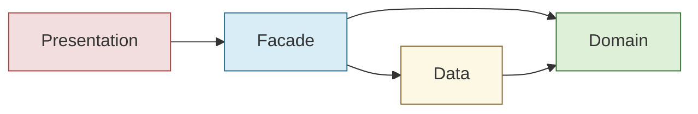

# Dependency overview (generated)

> Regenerated by `architecture-doc-agent` from `graphify-out/` and
> `architecture-guardian`'s live review. Never hand-edit — run `/docs architecture` to
> refresh.

## Layer dependency diagram



Allowed direction is inward only (Presentation → Facade → Data/Domain, Data → Domain).
**No layer may depend on a more outer one** — Domain must never import Data or
Presentation. Full rule text lives once in
[CLAUDE.md § Arquitecture Rules](../../../CLAUDE.md#arquitecture-rules-clean-architecture);
this diagram illustrates it, it doesn't redefine it. `architecture-guardian`'s latest
review found no import cycles and no layer-direction violations across
`time-entry`/`goals`/`planning`/`shared`/`core`, so this diagram is unchanged from the
prior pass — nothing about the layer-dependency direction needed to move.

## God Nodes

Full repo-wide Top 10 God Nodes per `graphify-out/GRAPH_REPORT.md` (graph built at
commit `7203d53`, refreshed against `HEAD` at `4b791f7`):

| Node | Edges | Rank | Layer / owning agent | Module doc |
|------|-------|------|-----------------------|------------|
| `@angular/core` | 65 | 1 | Framework (spans all layers) — n/a | |
| `@ngx-translate/core` | 39 | 2 | Framework/library (Facade + Presentation only, per Rule of Gold) — n/a | |
| `TimeEntryFacade` | 29 | 3 | Facade — `facade-agent` | |
| `TimeEntry` | 27 | 4 | Domain (`time-entry/domain/models.ts`) — `domain-agent` | |
| `DexieTimeEntryRepository` | 25 | 5 | Data (`time-entry/data/`) — `data-agent` | |
| `ITimeEntryRepository` | 23 | 6 | Domain (`time-entry/domain/i-time-entry.repository.ts`) — `domain-agent` | |
| `CourseVisit` | 23 | 7 | Domain (`time-entry/domain/models.ts`) — `domain-agent` | |
| `WeeklySchedule` | 22 | 8 | Domain (`planning/domain/models.ts`) — `domain-agent` | [planning/overview.md](../modules/planning/overview.md#god-nodes-in-this-module) |
| `WeeklyScheduleEditorComponent` | 21 | 9 | Presentation (`planning/presentation/components/weekly-schedule-editor/`) — `ui-agent` | [planning/overview.md](../modules/planning/overview.md#god-nodes-in-this-module) |
| `GoalConfig` | 21 | 10 | Domain (`goals/domain/models.ts`) — `domain-agent` | |

Module doc links are only filled in where a generated module overview exists today
(`docs/generated/modules/planning/overview.md`). `time-entry` and `goals` don't have a
generated module overview yet — their column is left blank rather than a fabricated
link; run `/docs module time-entry` / `/docs module goals` to add one.

The framework/library nodes (`@angular/core`, `@ngx-translate/core`) aren't owned by a
single layer agent — they're cross-cutting dependencies whose *placement* is constrained
by the Layer Dependency Rules (e.g. Domain must never import either of them) rather than
owned by one.

## How this doc is produced

```bash
graphify update .
graphify query "layer dependency violations"
/docs architecture   # architecture-doc-agent regenerates this file
```
